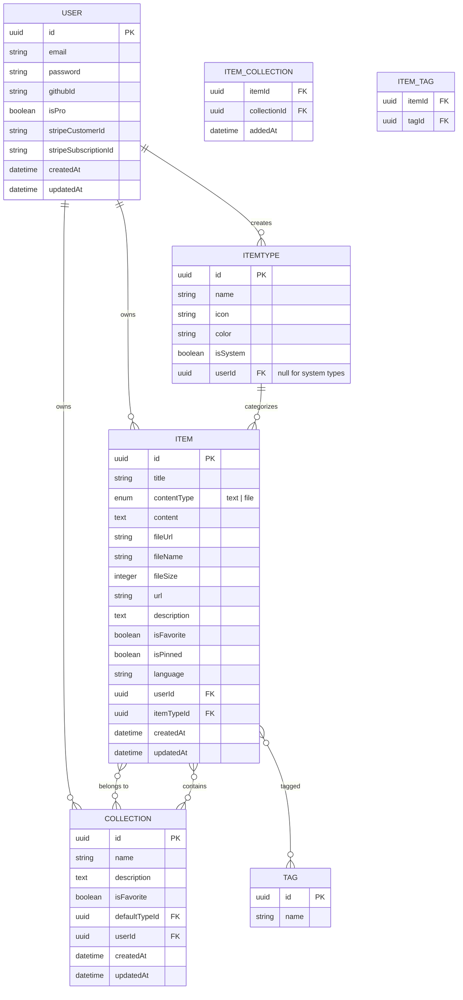
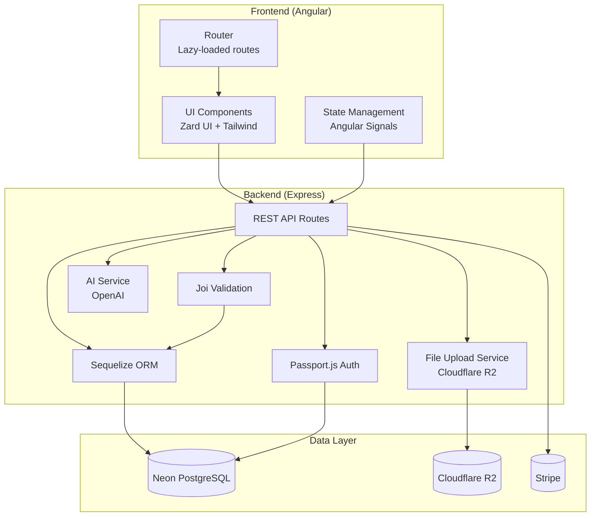

# DevStash — Project Overview

> **One hub for all your dev knowledge.** Snippets, prompts, commands, notes, files, images, and links — fast, searchable, and AI-enhanced.

---

## Table of Contents

- [Problem](#problem)
- [Target Users](#target-users)
- [Features](#features)
- [Data Model](#data-model)
- [Sequelize Models (Rough Draft)](#sequelize-models-rough-draft)
- [Tech Stack](#tech-stack)
- [Architecture](#architecture)
- [API Routes](#api-routes)
- [Monetization](#monetization)
- [UI/UX](#uiux)
- [Type Colors & Icons](#type-colors--icons)
- [Development Phases](#development-phases)
- [Reference Links](#reference-links)

---

## Problem

Developers keep their essentials scattered across tools:

| Scattered Location | Example |
|---|---|
| VS Code / Notion | Code snippets |
| ChatGPT / Claude | AI prompts |
| Project folders | Context files |
| Browser bookmarks | Useful links |
| Random folders | Documentation |
| `.txt` files | Shell commands |
| GitHub Gists | Project templates |
| Bash history | Terminal commands |

**Result:** Context switching, lost knowledge, inconsistent workflows.

**DevStash** = ONE fast, searchable, AI-enhanced hub for all dev knowledge & resources.

---

## Target Users

| Persona | Needs |
|---|---|
| **Everyday Developer** | Fast access to snippets, prompts, commands, links |
| **AI-first Developer** | Save prompts, contexts, workflows, system messages |
| **Content Creator / Educator** | Store code blocks, explanations, course notes |
| **Full-stack Builder** | Collect patterns, boilerplates, API examples |

---

## Features

### A. Items & Item Types

Items are the core unit of content. Each item has a **type**.

**System types** (immutable, built-in):

| Type | Content Kind | Tier | URL Pattern |
|---|---|---|---|
| `snippet` | text | Free | `/items/snippets` |
| `prompt` | text | Free | `/items/prompts` |
| `note` | text | Free | `/items/notes` |
| `command` | text | Free | `/items/commands` |
| `link` | url | Free | `/items/links` |
| `file` | file | Pro | `/items/files` |
| `image` | file | Pro | `/items/images` |

- Users can create **custom types** (Pro feature, post-launch).
- Items are created and viewed in a **quick-access drawer**.

### B. Collections

- Group items of any type into named collections.
- An item can belong to **multiple collections** (many-to-many).
- Examples: *React Patterns*, *Context Files*, *Python Snippets*, *Interview Prep*.

### C. Search

Full-text search across:
- Content body
- Tags
- Titles
- Item types

### D. Authentication

- Email/password (Passport.js local strategy)
- GitHub OAuth (Passport.js GitHub strategy)

### E. Additional Features

- Favorites (collections and items)
- Pin items to top
- Recently used items
- Import code from file
- Markdown editor for text types
- File upload for file/image types
- Export data (JSON, ZIP)
- Dark mode (default)
- Add/remove items to/from multiple collections
- View collection membership per item

### F. AI Features (Pro)

| Feature | Description |
|---|---|
| Auto-tag | AI suggests tags based on content |
| Summaries | AI generates item summaries |
| Explain Code | AI explains selected code blocks |
| Prompt Optimizer | AI improves prompt clarity and effectiveness |

---

## Data Model

### Entity-Relationship Diagram



---

## Sequelize Models (Rough Draft)

> **Note:** These are preliminary model definitions for planning purposes. They will evolve during development. Uses Sequelize v6 with TypeScript.

### User

```typescript
// models/User.ts
import { DataTypes, Model, Optional } from 'sequelize';
import { sequelize } from '../config/database';

interface UserAttributes {
  id: string;
  email: string;
  password: string | null;
  githubId: string | null;
  displayName: string | null;
  avatarUrl: string | null;
  isPro: boolean;
  stripeCustomerId: string | null;
  stripeSubscriptionId: string | null;
  createdAt?: Date;
  updatedAt?: Date;
}

interface UserCreationAttributes extends Optional<UserAttributes, 'id' | 'password' | 'githubId' | 'displayName' | 'avatarUrl' | 'isPro' | 'stripeCustomerId' | 'stripeSubscriptionId'> {}

class User extends Model<UserAttributes, UserCreationAttributes> implements UserAttributes {
  declare id: string;
  declare email: string;
  declare password: string | null;
  declare githubId: string | null;
  declare displayName: string | null;
  declare avatarUrl: string | null;
  declare isPro: boolean;
  declare stripeCustomerId: string | null;
  declare stripeSubscriptionId: string | null;
  declare createdAt: Date;
  declare updatedAt: Date;

  declare items?: Item[];
  declare collections?: Collection[];
  declare itemTypes?: ItemType[];
}

User.init(
  {
    id: {
      type: DataTypes.UUID,
      defaultValue: DataTypes.UUIDV4,
      primaryKey: true,
    },
    email: {
      type: DataTypes.STRING,
      allowNull: false,
      unique: true,
      validate: { isEmail: true },
    },
    password: {
      type: DataTypes.STRING,
      allowNull: true,
    },
    githubId: {
      type: DataTypes.STRING,
      allowNull: true,
      unique: true,
    },
    displayName: {
      type: DataTypes.STRING,
      allowNull: true,
    },
    avatarUrl: {
      type: DataTypes.STRING,
      allowNull: true,
    },
    isPro: {
      type: DataTypes.BOOLEAN,
      defaultValue: false,
    },
    stripeCustomerId: {
      type: DataTypes.STRING,
      allowNull: true,
    },
    stripeSubscriptionId: {
      type: DataTypes.STRING,
      allowNull: true,
    },
  },
  {
    sequelize,
    modelName: 'User',
    tableName: 'users',
    timestamps: true,
  }
);

export default User;
```

### Item

```typescript
// models/Item.ts
import { DataTypes, Model, Optional } from 'sequelize';
import { sequelize } from '../config/database';

interface ItemAttributes {
  id: string;
  title: string;
  contentType: 'text' | 'file';
  content: string | null;
  fileUrl: string | null;
  fileName: string | null;
  fileSize: number | null;
  url: string | null;
  description: string | null;
  isFavorite: boolean;
  isPinned: boolean;
  language: string | null;
  userId: string;
  itemTypeId: string;
  createdAt?: Date;
  updatedAt?: Date;
}

interface ItemCreationAttributes extends Optional<ItemAttributes, 'id' | 'content' | 'fileUrl' | 'fileName' | 'fileSize' | 'url' | 'description' | 'isFavorite' | 'isPinned' | 'language'> {}

class Item extends Model<ItemAttributes, ItemCreationAttributes> implements ItemAttributes {
  declare id: string;
  declare title: string;
  declare contentType: 'text' | 'file';
  declare content: string | null;
  declare fileUrl: string | null;
  declare fileName: string | null;
  declare fileSize: number | null;
  declare url: string | null;
  declare description: string | null;
  declare isFavorite: boolean;
  declare isPinned: boolean;
  declare language: string | null;
  declare userId: string;
  declare itemTypeId: string;
  declare createdAt: Date;
  declare updatedAt: Date;

  declare user?: User;
  declare itemType?: ItemType;
  declare tags?: Tag[];
  declare collections?: Collection[];
}

Item.init(
  {
    id: {
      type: DataTypes.UUID,
      defaultValue: DataTypes.UUIDV4,
      primaryKey: true,
    },
    title: {
      type: DataTypes.STRING(255),
      allowNull: false,
    },
    contentType: {
      type: DataTypes.ENUM('text', 'file'),
      allowNull: false,
    },
    content: {
      type: DataTypes.TEXT,
      allowNull: true,
    },
    fileUrl: {
      type: DataTypes.STRING,
      allowNull: true,
    },
    fileName: {
      type: DataTypes.STRING,
      allowNull: true,
    },
    fileSize: {
      type: DataTypes.INTEGER,
      allowNull: true,
    },
    url: {
      type: DataTypes.STRING(2048),
      allowNull: true,
    },
    description: {
      type: DataTypes.TEXT,
      allowNull: true,
    },
    isFavorite: {
      type: DataTypes.BOOLEAN,
      defaultValue: false,
    },
    isPinned: {
      type: DataTypes.BOOLEAN,
      defaultValue: false,
    },
    language: {
      type: DataTypes.STRING(50),
      allowNull: true,
    },
    userId: {
      type: DataTypes.UUID,
      allowNull: false,
      references: { model: 'users', key: 'id' },
      onDelete: 'CASCADE',
    },
    itemTypeId: {
      type: DataTypes.UUID,
      allowNull: false,
      references: { model: 'item_types', key: 'id' },
    },
  },
  {
    sequelize,
    modelName: 'Item',
    tableName: 'items',
    timestamps: true,
    indexes: [
      { fields: ['userId'] },
      { fields: ['itemTypeId'] },
      { fields: ['isFavorite'] },
      { fields: ['isPinned'] },
    ],
  }
);

export default Item;
```

### ItemType

```typescript
// models/ItemType.ts
import { DataTypes, Model, Optional } from 'sequelize';
import { sequelize } from '../config/database';

interface ItemTypeAttributes {
  id: string;
  name: string;
  slug: string;
  icon: string;
  color: string;
  isSystem: boolean;
  userId: string | null;
}

interface ItemTypeCreationAttributes extends Optional<ItemTypeAttributes, 'id' | 'userId'> {}

class ItemType extends Model<ItemTypeAttributes, ItemTypeCreationAttributes> implements ItemTypeAttributes {
  declare id: string;
  declare name: string;
  declare slug: string;
  declare icon: string;
  declare color: string;
  declare isSystem: boolean;
  declare userId: string | null;

  declare items?: Item[];
  declare user?: User;
}

ItemType.init(
  {
    id: {
      type: DataTypes.UUID,
      defaultValue: DataTypes.UUIDV4,
      primaryKey: true,
    },
    name: {
      type: DataTypes.STRING(50),
      allowNull: false,
    },
    slug: {
      type: DataTypes.STRING(50),
      allowNull: false,
    },
    icon: {
      type: DataTypes.STRING(50),
      allowNull: false,
    },
    color: {
      type: DataTypes.STRING(7),
      allowNull: false,
    },
    isSystem: {
      type: DataTypes.BOOLEAN,
      defaultValue: false,
    },
    userId: {
      type: DataTypes.UUID,
      allowNull: true,
      references: { model: 'users', key: 'id' },
      onDelete: 'CASCADE',
    },
  },
  {
    sequelize,
    modelName: 'ItemType',
    tableName: 'item_types',
    timestamps: false,
    indexes: [
      { unique: true, fields: ['slug', 'userId'] },
    ],
  }
);

export default ItemType;
```

### Collection

```typescript
// models/Collection.ts
import { DataTypes, Model, Optional } from 'sequelize';
import { sequelize } from '../config/database';

interface CollectionAttributes {
  id: string;
  name: string;
  description: string | null;
  isFavorite: boolean;
  defaultTypeId: string | null;
  userId: string;
  createdAt?: Date;
  updatedAt?: Date;
}

interface CollectionCreationAttributes extends Optional<CollectionAttributes, 'id' | 'description' | 'isFavorite' | 'defaultTypeId'> {}

class Collection extends Model<CollectionAttributes, CollectionCreationAttributes> implements CollectionAttributes {
  declare id: string;
  declare name: string;
  declare description: string | null;
  declare isFavorite: boolean;
  declare defaultTypeId: string | null;
  declare userId: string;
  declare createdAt: Date;
  declare updatedAt: Date;

  declare items?: Item[];
  declare user?: User;
}

Collection.init(
  {
    id: {
      type: DataTypes.UUID,
      defaultValue: DataTypes.UUIDV4,
      primaryKey: true,
    },
    name: {
      type: DataTypes.STRING(100),
      allowNull: false,
    },
    description: {
      type: DataTypes.TEXT,
      allowNull: true,
    },
    isFavorite: {
      type: DataTypes.BOOLEAN,
      defaultValue: false,
    },
    defaultTypeId: {
      type: DataTypes.UUID,
      allowNull: true,
      references: { model: 'item_types', key: 'id' },
    },
    userId: {
      type: DataTypes.UUID,
      allowNull: false,
      references: { model: 'users', key: 'id' },
      onDelete: 'CASCADE',
    },
  },
  {
    sequelize,
    modelName: 'Collection',
    tableName: 'collections',
    timestamps: true,
    indexes: [
      { fields: ['userId'] },
    ],
  }
);

export default Collection;
```

### Tag

```typescript
// models/Tag.ts
import { DataTypes, Model, Optional } from 'sequelize';
import { sequelize } from '../config/database';

interface TagAttributes {
  id: string;
  name: string;
}

interface TagCreationAttributes extends Optional<TagAttributes, 'id'> {}

class Tag extends Model<TagAttributes, TagCreationAttributes> implements TagAttributes {
  declare id: string;
  declare name: string;

  declare items?: Item[];
}

Tag.init(
  {
    id: {
      type: DataTypes.UUID,
      defaultValue: DataTypes.UUIDV4,
      primaryKey: true,
    },
    name: {
      type: DataTypes.STRING(50),
      allowNull: false,
      unique: true,
    },
  },
  {
    sequelize,
    modelName: 'Tag',
    tableName: 'tags',
    timestamps: false,
  }
);

export default Tag;
```

### Associations

```typescript
// models/associations.ts
import User from './User';
import Item from './Item';
import ItemType from './ItemType';
import Collection from './Collection';
import Tag from './Tag';

// User -> Items, Collections, ItemTypes
User.hasMany(Item, { foreignKey: 'userId', as: 'items' });
User.hasMany(Collection, { foreignKey: 'userId', as: 'collections' });
User.hasMany(ItemType, { foreignKey: 'userId', as: 'itemTypes' });

Item.belongsTo(User, { foreignKey: 'userId', as: 'user' });
Collection.belongsTo(User, { foreignKey: 'userId', as: 'user' });
ItemType.belongsTo(User, { foreignKey: 'userId', as: 'user' });

// ItemType -> Items
ItemType.hasMany(Item, { foreignKey: 'itemTypeId', as: 'items' });
Item.belongsTo(ItemType, { foreignKey: 'itemTypeId', as: 'itemType' });

// Item <-> Collection (many-to-many)
Item.belongsToMany(Collection, {
  through: 'item_collections',
  foreignKey: 'itemId',
  otherKey: 'collectionId',
  as: 'collections',
});
Collection.belongsToMany(Item, {
  through: 'item_collections',
  foreignKey: 'collectionId',
  otherKey: 'itemId',
  as: 'items',
});

// Item <-> Tag (many-to-many)
Item.belongsToMany(Tag, {
  through: 'item_tags',
  foreignKey: 'itemId',
  otherKey: 'tagId',
  as: 'tags',
});
Tag.belongsToMany(Item, {
  through: 'item_tags',
  foreignKey: 'tagId',
  otherKey: 'itemId',
  as: 'items',
});

// Collection -> default ItemType
Collection.belongsTo(ItemType, { foreignKey: 'defaultTypeId', as: 'defaultType' });
```

---

## Tech Stack

| Layer | Technology | Purpose |
|---|---|---|
| **Frontend** | [Angular](https://angular.dev/) (v22+) | SPA framework |
| **UI Components** | [Zard UI](https://zardui.com/) | Component library |
| **Styling** | [Tailwind CSS v4](https://tailwindcss.com/) | Utility-first CSS |
| **Backend** | [Express](https://expressjs.com/) | REST API server |
| **Language** | [TypeScript](https://www.typescriptlang.org/) | Type safety across stack |
| **Database** | [Neon](https://neon.tech/) (PostgreSQL) | Serverless Postgres |
| **ORM** | [Sequelize v6](https://sequelize.org/) | Database ORM |
| **Auth** | [Passport.js](https://www.passportjs.org/) | Local + GitHub OAuth |
| **File Storage** | [Cloudflare R2](https://developers.cloudflare.com/r2/) | S3-compatible object storage |
| **AI** | [OpenAI](https://platform.openai.com/) (gpt-5-nano) | AI features |
| **Payments** | [Stripe](https://stripe.com/) | Subscription billing |
| **Validation** | [Joi](https://joi.dev/) | Request payload validation |
| **Caching** | Redis (TBD) | Optional caching layer |
| **Monorepo** | Single repo | `frontend/` + `backend/` |

### Validation with Joi

All incoming request payloads are validated using [Joi](https://joi.dev/) before reaching route handlers.

**Approach:**
- Each route group has its own `*.validation.ts` file defining Joi schemas (e.g. `items.validation.ts`, `auth.validation.ts`).
- A shared `validate` middleware applies the schema to `req.body`, `req.query`, or `req.params` and returns `400 Bad Request` with descriptive errors on failure.
- Joi schemas are the **single source of truth** for input shape — Sequelize model validators are treated as a secondary safety net only.

**Example pattern:**

```typescript
// middlewares/validate.ts
import Joi from 'joi';
import { Request, Response, NextFunction } from 'express';

export const validate = (schema: Joi.ObjectSchema, property: 'body' | 'query' | 'params' = 'body') => {
  return (req: Request, res: Response, next: NextFunction) => {
    const { error, value } = schema.validate(req[property], { abortEarly: false, stripUnknown: true });
    if (error) {
      return res.status(400).json({
        message: 'Validation error',
        errors: error.details.map(d => ({ field: d.path.join('.'), message: d.message })),
      });
    }
    req[property] = value;
    next();
  };
};
```

```typescript
// validations/items.validation.ts
import Joi from 'joi';

export const createItemSchema = Joi.object({
  title: Joi.string().max(255).required(),
  content: Joi.string().allow(null, ''),
  url: Joi.string().uri().max(2048).allow(null, ''),
  description: Joi.string().allow(null, ''),
  language: Joi.string().max(50).allow(null, ''),
  itemTypeId: Joi.string().uuid().required(),
  tags: Joi.array().items(Joi.string().uuid()).optional(),
  collectionIds: Joi.array().items(Joi.string().uuid()).optional(),
});

export const updateItemSchema = Joi.object({
  title: Joi.string().max(255),
  content: Joi.string().allow(null, ''),
  url: Joi.string().uri().max(2048).allow(null, ''),
  description: Joi.string().allow(null, ''),
  language: Joi.string().max(50).allow(null, ''),
  itemTypeId: Joi.string().uuid(),
  tags: Joi.array().items(Joi.string().uuid()),
  collectionIds: Joi.array().items(Joi.string().uuid()),
}).min(1);
```

```typescript
// routes/items.ts
import { validate } from '../middlewares/validate';
import { createItemSchema, updateItemSchema } from '../validations/items.validation';

router.post('/', validate(createItemSchema), itemController.create);
router.put('/:id', validate(updateItemSchema), itemController.update);
```

### Architecture Diagram



---

## API Routes

### Auth

| Method | Route | Description |
|---|---|---|
| `POST` | `/api/auth/register` | Register with email/password |
| `POST` | `/api/auth/login` | Login with email/password |
| `GET` | `/api/auth/github` | Initiate GitHub OAuth |
| `GET` | `/api/auth/github/callback` | GitHub OAuth callback |
| `POST` | `/api/auth/logout` | Logout current user |
| `GET` | `/api/auth/me` | Get current user profile |

### Items

| Method | Route | Description |
|---|---|---|
| `GET` | `/api/items` | List items (with filters: type, collection, search) |
| `GET` | `/api/items/:id` | Get single item |
| `POST` | `/api/items` | Create item |
| `PUT` | `/api/items/:id` | Update item |
| `DELETE` | `/api/items/:id` | Delete item |
| `PATCH` | `/api/items/:id/favorite` | Toggle favorite |
| `PATCH` | `/api/items/:id/pin` | Toggle pin |
| `GET` | `/api/items/recent` | Get recently used items |
| `POST` | `/api/items/import` | Import items from file |

### Collections

| Method | Route | Description |
|---|---|---|
| `GET` | `/api/collections` | List collections |
| `GET` | `/api/collections/:id` | Get collection with items |
| `POST` | `/api/collections` | Create collection |
| `PUT` | `/api/collections/:id` | Update collection |
| `DELETE` | `/api/collections/:id` | Delete collection |
| `PATCH` | `/api/collections/:id/favorite` | Toggle favorite |
| `POST` | `/api/collections/:id/items` | Add item(s) to collection |
| `DELETE` | `/api/collections/:id/items/:itemId` | Remove item from collection |

### Item Types

| Method | Route | Description |
|---|---|---|
| `GET` | `/api/item-types` | List all types (system + custom) |
| `POST` | `/api/item-types` | Create custom type (Pro) |
| `PUT` | `/api/item-types/:id` | Update custom type (Pro) |
| `DELETE` | `/api/item-types/:id` | Delete custom type (Pro) |

### Tags

| Method | Route | Description |
|---|---|---|
| `GET` | `/api/tags` | List all user tags |
| `POST` | `/api/tags` | Create tag |
| `DELETE` | `/api/tags/:id` | Delete tag |

### AI (Pro)

| Method | Route | Description |
|---|---|---|
| `POST` | `/api/ai/auto-tag` | Suggest tags for item content |
| `POST` | `/api/ai/summarize` | Generate item summary |
| `POST` | `/api/ai/explain-code` | Explain code block |
| `POST` | `/api/ai/optimize-prompt` | Optimize a prompt |

### Search

| Method | Route | Description |
|---|---|---|
| `GET` | `/api/search` | Full-text search across items |

### Export

| Method | Route | Description |
|---|---|---|
| `GET` | `/api/export/json` | Export all data as JSON |
| `GET` | `/api/export/zip` | Export all data as ZIP |

### Files

| Method | Route | Description |
|---|---|---|
| `POST` | `/api/files/upload` | Upload file to R2 |

---

## Monetization

### Free vs Pro Comparison

| Feature | Free | Pro ($8/mo or $72/yr) |
|---|:---:|:---:|
| Total items | 50 | Unlimited |
| Collections | 3 | Unlimited |
| System types (snippet, prompt, note, command, link) | Yes | Yes |
| File & image types | - | Yes |
| File/image uploads | - | Yes |
| Custom item types | - | Yes (post-launch) |
| Basic search | Yes | Yes |
| AI auto-tagging | - | Yes |
| AI summaries | - | Yes |
| AI code explanation | - | Yes |
| AI prompt optimizer | - | Yes |
| Export (JSON/ZIP) | - | Yes |
| Priority support | - | Yes |

> **Development note:** Pro feature gates are scaffolded but disabled during development — all users have full access.

---

## UI/UX

### Design Principles

- Modern, minimal, developer-focused
- **Dark mode** by default, light mode optional
- Clean typography, generous whitespace
- Subtle borders and shadows
- Syntax highlighting for code blocks
- **Inspiration:** Notion, Linear, Raycast

### Screenshots

Refer to the screenshots below as a base design for the dashboard ui. Use it as a visual queue and reference.

@context/screenshots/dashboard-ui-drawer.png
@context/screenshots/dashboard-ui-main.png

### Layout

```
+------------------+------------------------------------------+
|                  |                                          |
|    SIDEBAR       |           MAIN CONTENT                   |
|  (collapsible)   |                                          |
|                  |   +----------+  +----------+             |
|  Item Types      |   |Collection|  |Collection|             |
|  - Snippets      |   |  Card    |  |  Card    |  ...        |
|  - Prompts       |   +----------+  +----------+             |
|  - Commands      |                                          |
|  - Notes         |   +--------+ +--------+ +--------+      |
|  - Links         |   | Item   | | Item   | | Item   |      |
|  - Files (Pro)   |   | Card   | | Card   | | Card   |      |
|  - Images (Pro)  |   +--------+ +--------+ +--------+      |
|                  |                                          |
|  Collections     |                                          |
|  - Recent...     |                                          |
+------------------+------------------------------------------+
```

- **Sidebar:** Item type navigation + recent collections
- **Main:** Color-coded collection cards (background = dominant type). Items displayed as cards with type-colored borders.
- **Drawer:** Items open in a quick-access side drawer (not a full page)

### Type Colors & Icons

| Type | Color | Hex | Icon (Lucide) |
|---|---|---|---|
| Snippet | Blue | `#3b82f6` | `Code` |
| Prompt | Purple | `#8b5cf6` | `Sparkles` |
| Command | Orange | `#f97316` | `Terminal` |
| Note | Yellow | `#fde047` | `StickyNote` |
| File | Gray | `#6b7280` | `File` |
| Image | Pink | `#ec4899` | `Image` |
| Link | Emerald | `#10b981` | `Link` |

### Responsive

- Desktop-first, mobile usable
- Sidebar collapses to drawer on mobile

### Micro-interactions

- Smooth transitions on all state changes
- Hover states on cards and buttons
- Toast notifications for CRUD actions
- Loading skeletons for async content

---

## Development Phases

### Phase 1 — Foundation

- [ ] Project scaffolding (Angular + Express monorepo)
- [ ] Database setup (Neon + Sequelize models + migrations)
- [ ] Authentication (Passport.js local + GitHub OAuth)
- [ ] Basic CRUD for items, collections, tags
- [ ] System item types seeded

### Phase 2 — Core Experience

- [ ] Sidebar navigation with item type filtering
- [ ] Collection cards with color coding
- [ ] Item drawer (create, view, edit)
- [ ] Markdown editor for text items
- [ ] Search (content, tags, titles, types)
- [ ] Favorites and pinning
- [ ] Recently used tracking
- [ ] Dark/light mode toggle

### Phase 3 — Pro Features

- [ ] File/image upload (Cloudflare R2)
- [ ] Custom item types
- [ ] AI auto-tagging
- [ ] AI summaries
- [ ] AI code explanation
- [ ] AI prompt optimizer
- [ ] Export (JSON/ZIP)

### Phase 4 — Polish & Launch

- [ ] Stripe integration
- [ ] Free tier limits enforcement
- [ ] Responsive polish
- [ ] Accessibility audit (AXE + WCAG AA)
- [ ] Performance optimization
- [ ] Landing page

---

## Reference Links

| Resource | Link |
|---|---|
| Angular Docs | https://angular.dev/ |
| Express Docs | https://expressjs.com/ |
| Sequelize v6 Docs | https://sequelize.org/docs/v6/ |
| Neon Docs | https://neon.tech/docs |
| Passport.js Docs | https://www.passportjs.org/docs/ |
| Cloudflare R2 Docs | https://developers.cloudflare.com/r2/ |
| Tailwind CSS v4 | https://tailwindcss.com/docs |
| Zard UI | https://zardui.com/ |
| Lucide Icons | https://lucide.dev/icons/ |
| Stripe Docs | https://docs.stripe.com/ |
| OpenAI API Docs | https://platform.openai.com/docs |
